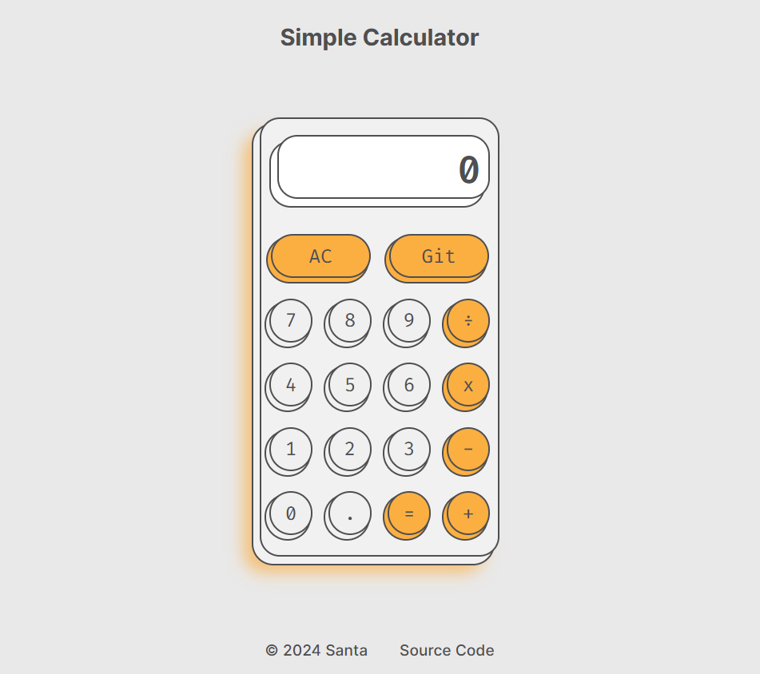

<h3 align="center">Simple Calculator</h3>

  

    For Simple Calculations
     
    <a href="https://notsanta20.github.io/calculator/" target="_blank">Live Demo</a>
  

 
<!-- ABOUT THE PROJECT -->
## Preview

 

### Built With

<!-- ACKNOWLEDGMENTS -->
## Acknowledgments

* Inspiration by <a href="https://www.theodinproject.com/lessons/foundations-calculator" target="_blank">The Odin Project</a>
* <a href="https://dribbble.com/shots/6129386-Daily-Ui-Challenge-04" target="_blank">Design Inspiration</a>
